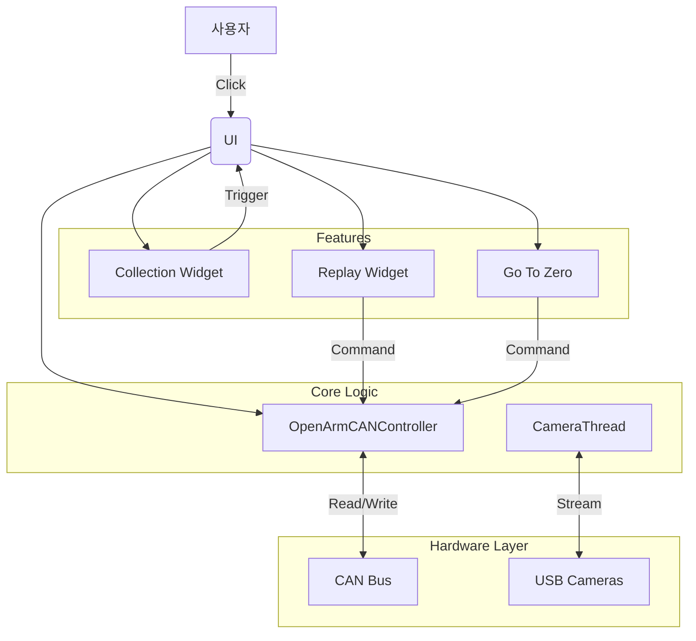

# 01. 시스템 아키텍처 (System Architecture)

## 개요 (Overview)
**OpenArm GUI (Data Collector)**는 양팔 로봇(Bimanual Robot)의 데이터를 수집하고, 제어 및 리플레이를 수행하기 위한 **PyQt6 기반의 단일 PC 애플리케이션**입니다.
복잡한 미들웨어(ROS, ZeroMQ)를 거치지 않고 하드웨어 드라이버에 직접 액세스하여 **낮은 지연 시간(Low Latency)**과 **간편한 사용**을 목표로 합니다.

## 디렉토리 구조 (Directory Structure)
```
openarm_gui/
├── src/
│   ├── core/
│   │   └── can_controller.py      # 로봇 제어 및 통신 (CAN bus)
│   ├── ui/
│   │   └── main_window.py         # 메인 윈도우 및 전체 로직 통합
│   └── widgets/
│       ├── camera_widget.py       # RealSense 카메라 스트리밍 및 스레드
│       ├── collection_widget.py   # 데이터 수집 UI
│       └── replay_widget.py       # 데이터 재생 및 보간 로직
├── config/
│   └── config.yaml                # 카메라 시리얼 번호 등 설정 파일
├── doc/                           # 기술 문서
└── start_gui.sh                   # 실행 스크립트
```

## 핵심 모듈 연동도 (Module Interaction)


## 주요 설계 원칙
1.  **Direct Hardware Access**: `python-can`과 `pyrealsense2`를 사용하여 중간 레이어 없이 하드웨어를 직접 제어합니다.
2.  **Threading**: UI의 응답성을 유지하기 위해 무거운 작업(카메라 수신, 로봇 통신, 리플레이 루프)은 모두 별도의 `QThread`로 분리되어 있습니다.
3.  **Safety First**: 리플레이와 영점 이동 시 급격한 움직임을 방지하기 위해 소프트웨어 레벨의 **Interpolation(보간)** 로직이 내장되어 있습니다.
